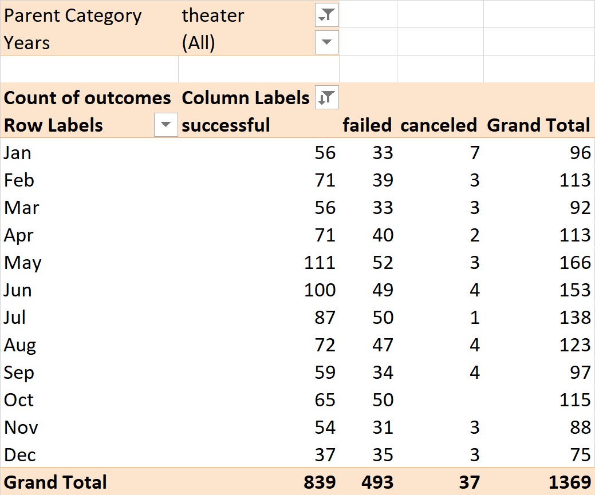
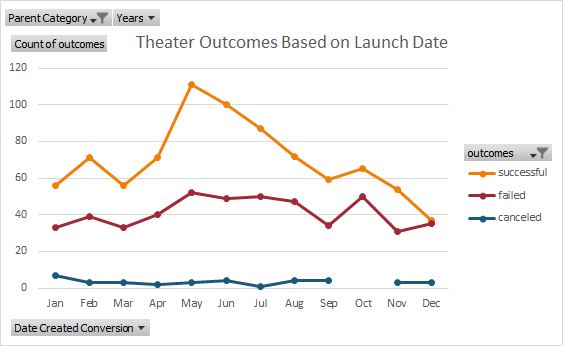
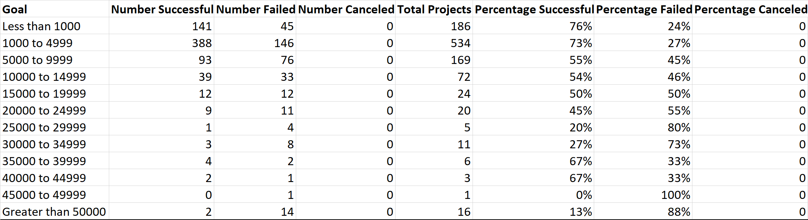
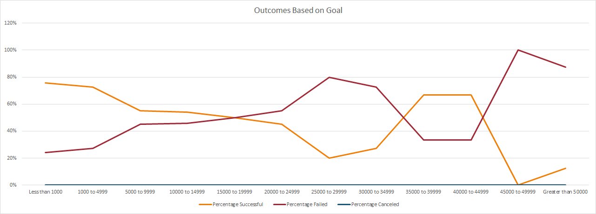

# An Analysis of Kickstarter Campaigns
## Overview of Project

### Background
The client for this project was an up-and-coming playwright <!-- aka my main squeeze louise--> who wanted to create a crowdfunding campaign for a play titled "Fever". In a previous project for this client, data from previous crowdfunding campaigns was analyzed in order to determine a budget for the client's campaign. Once a budget was set, the client successfully raised the goal amount in a short period of time. The client then requested further analyses of the crowdfunding campaign data. <!--louise is needy-->
### Purpose
The purpose of the current project was to analyze the previous campaign data in order to compare the campaign outcomes in relation to their respective launch dates and monetary goals. The results of the analysis can be used by the client to make informed decisions about their future ventures, as well as compare their campaign results to other campaigns.   
## Analysis and Challenges
### Analysis of Outcomes Based on Launch Date
To begin the analysis of outcomes based on launch date, a pivot table was created with the following parameters: <!-- not sure if parameter is a good word, may change -->

| Parameter | Field Used |
| --------- | -------- |
| Columns | Outcomes |
| Rows | Date Created |
| Values | Count of Outcomes |
| Filters  | Parent Category & Years |

After creating the initial table, the dates were grouped by month and the table was filtered to only include theater campaigns. This resulted in the table below. 

 

Next, a pivot chart was generated with the months on the x-axis, the count of outcomes on the y-axis, and each outcome denoted by a differently colored line. This was done in order to visualize the breakdown of campaign outcomes for each month and to visually determine if trends are present. The chart can be seen below. 

 

### Analysis of Outcomes Based on Goals
To begin the analysis of outcomes based on goals, a table was created with each row being a different goal amount category. The first category included goals less than $1000, and the subsequent increasing goal categories had ranges of $5000. The number of successful, failed, and canceled crowdfunding campaigns for plays were calculated for each goal category by using COUNTIFS statements. For example, the number of successful campaigns for plays that had goals from $1000 to $4999 was determined with =COUNTIFS(Kickstarter!$F:$F, "successful", Kickstarter!$D:$D, ">=1000", Kickstarter!$D:$D, "<=4999", Kickstarter!$R:$R, "plays"). The total number of campaigns for each goal category was then tallied and used to calculate the percentage of successful, failed, and cancelled campaigns for each goal category. The completed table is below. 

 

Once the table was completed, a chart was generated by using the goal categories on the x-axis and using the percentage columns of the table as the y-values. Different colored lines were used for each outcome. This chart was used to visually determine if trends are present. See below for the completed chart. 

 

### Challenges and Difficulties Encountered
While there were no difficulties with this project, one can identify many situations in which there might have been. For example, when creating the initial pivot table to analyze the outcomes based on launch date, it lists each date in separate rows. If an individual had not been able to group these dates by month, it would have been impossible to create a simple visualization of the data. In addition, if one had not known how to create an absolute reference rather than a relative reference, the countif formulas in the outcomes vs goals table would not have copied over to other columns correctly and would have had to been adjusted by hand. 

## Results
When looking at the graph of outcomes based on launch date, one can see that there are more successful campaigns than failed campaigns throughout the entire year (except for December, where they are roughly equal). In addition, failed and successful campaigns follow a silimar pattern throughout the year (e.g. when the number of successful campaigns increases, so does the number of failed). This may indicate that even when a larger number of campaigns are launched, the ratio of successful to failed stays relatively stable. Given this, one might assume that the time of year that a campaign is launched has no bearing on its probability of success. However, if we study the graph a little more closely, we can see that in the summer months (mostly May and June) there is a larger gap between the successful line and the failed line. This tells us that even when the number of total campaigns increases in the summer, the proportion of successful to failed campaigns increases as well. Because of this, it would probably be best to launch a campaign during May in order to give it the best chance of succeeding. 

When studying the outcomes based on goals graph, one can see that the percentage of successful campaigns is higher when the goal is less than $15,000. After this point, the percentage gradually decreases and even reaches zero. However, there is an irregularity in this pattern for campaigns with goals between $35,000 to $34,999. It would be interesting to examine the campaigns in this goal region to determine if there are special circumstances that led to them being successful despite their high goals. Overall, it would probably be best to set a campaign goal that is less than $15,000 in order to be successful. However, if there is a pattern discovered in the irregular range discussed above, and an individual's campaign is similar to those successful campaigns, then they may be able to set a higher goal. 
